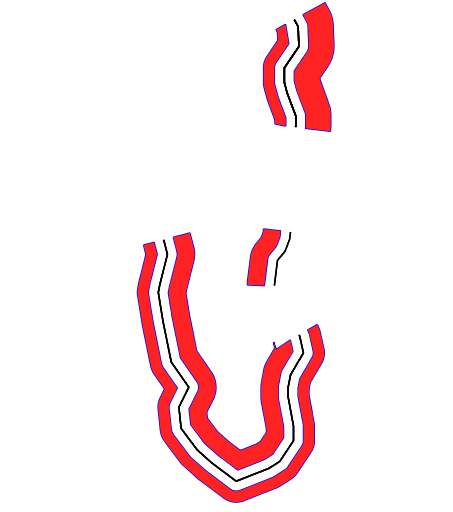

Geoserver rendering transformation for feature aggregation. See #14080071

# Installation

## Building the extension

Run

    make build
    
The generated JARs will be in the target/ directory.

## Installing into Geoserver

This extension depends on the WPS extension which needs to be installed first. See 
http://docs.geoserver.org/stable/en/user/extensions/wps/install.html on this topic.

To install this extension, drop all JARs to geoservers WEB-INF/lib/ directory and 
restart geoserver.

To see if the installation was successful you may check if the rendering transformations 
as WPS services. Just go to "Demos" -> "WPS request builder". The rendering transformations
should be available in the "Choose Process" select box. The names are 

* "gs:AggregateSimilarFeatures"
* "gs:AggregateSimilarLinesAsPolygon"

There is also a special "About Trafimage Rendering Transformations" page in "About & Status" 
menu which lists the version of the extension installed.

# Styling examples

For the SLD code for all examples see the examples directory. Documentation on the 
parameters of the rendering transformations is available in the "WPS request builder"
or in the source files.

Make sure you have an index on the geometries as this will speed up the aggregation significantly.

## AggregateSimilarFeatures:

## AggregateSimilarLinesAsPolygon:

# Development

## Developing and Debugging using eclipse

* Load geoserver into eclipse using "File" -> "Import..". Import Geoserver as an "Existing Maven project", otherwise the WPS extension will not be available.
* Load this project into eclipse. Also import as an "Existing Maven project".
* Right-click geoservers importet "web-app" project. Go to "Properties". There add the project of the rendering transformations to "Project References".
* Launch Geoserver by selecting "Run" -> "Java Application" in the right-click menu of the class src/test/java/org.geoserver/web/Start.java in the "web-app" project. The same should work for "Debug" -> "Java Application".

There is also a guide for using eclipse with geoserver at http://docs.geoserver.org/latest/en/developer/eclipse-guide/ .

## Version information

Tha Jars build usiing `make` contain the git commit hash of the source. This can be viewed by opening the file "trafimage-geoserver-transformations.gitversion" bundled in the JAR.
